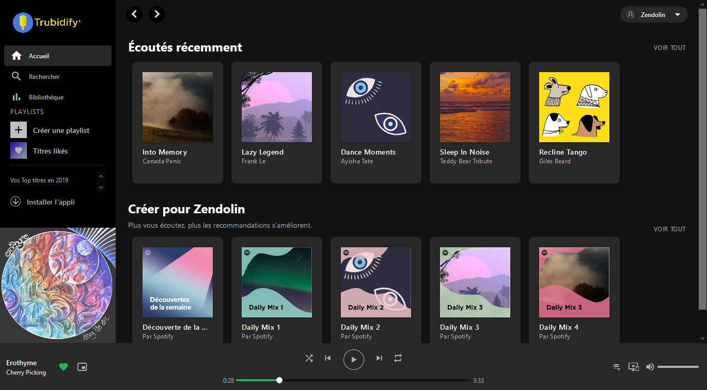
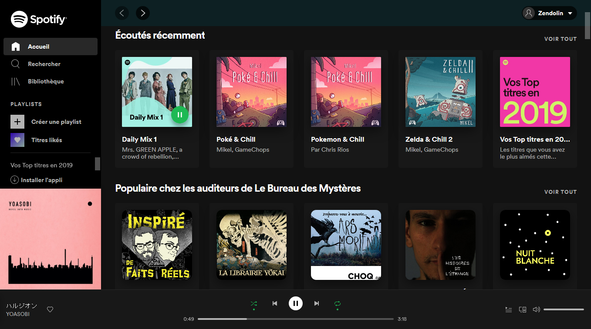

<h1 align="center">Trubidify</h1>

## Table of Contents
* [Introduction](#introduction)
* [Screenshots](#screenshots)
* [How to Use](#how-to-use)
* [Build With](#build-with)

## Introduction
Trubidify is a Spotify-like UI. This project aims to improve my skills in UI with VueJS.
It was inspired by the video [Build a Spotify home page using tailwind.css and Vue.js](https://www.youtube.com/watch?v=w5GQcHxJH1w) by this.stephie

## Screenshots

**
TRUBIDIFY
**

**
SPOTIFY
**

## How to Use
After cloning the repository :
`npm install`

Then open the local server for development :
`npm run serve`

And for production build :
`npm run build`

## Build With
* VueJS : 3.0.0
* Tailwind CSS : 2.0.2
* Material Icons from Google

## Credits
* Music (Erothyme - Cherry Picking) from [Erothyme Bandcamp](https://erothyme.bandcamp.com)
* Images from [Pixabay](https://pixabay.com/fr/), Spotify Assets, and some pictures made by myself.

